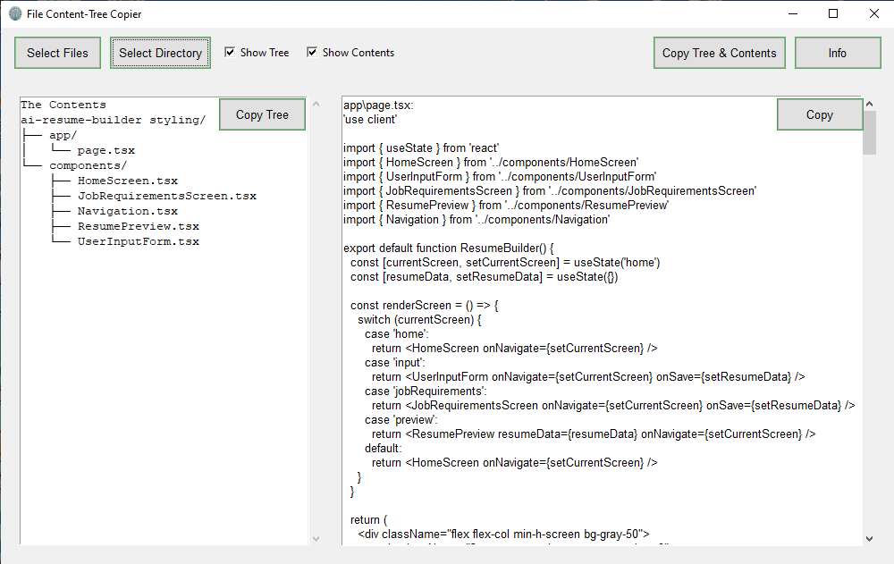

# File Content-Tree Copier

The **File Content-Tree Copier** is a utility application designed to simplify the process of copying code files and their directory structure. It is especially useful for developers who need to quickly provide code snippets or entire projects to collaborators or debugging tools like GPT.

## Features
- Easy copying of multiple files while preserving directory structure.
- User-friendly interface for selecting files and folders.
- Supports batch operations to streamline your workflow.

## Usage
1. Download the executable from the link below.
2. Run the application and select the files or directories you want to copy.
3. Specify the destination where the files should be copied.
4. Click the "Copy" button to complete the process.

## Download Executable

You can download the executable version of the application from the following link:
- [Release](https://github.com/Shery-1508/File-Contents-Tree-Copier/releases/tag/v1.0.0)
- [Download File Content-Tree Copier](https://github.com/Shery-1508/File-Contents-Tree-Copier/releases/download/v1.0.0/File.Content-Tree.Copier.exe)
  
 

## Screenshot

## Requirements
- Windows operating system
- .NET Framework (if applicable)

## License
This project is licensed under the MIT License - see the [LICENSE](LICENSE) file for details.

## Contributing
Feel free to contribute by submitting issues or pull requests to help improve the application.
